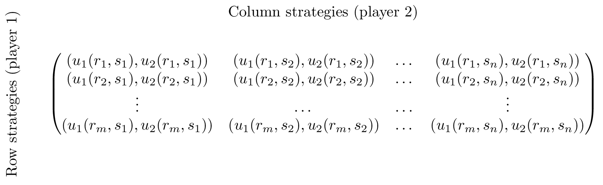

## Recap

In the [previous chapter]({{site.baseurl}}/Content/Chapter_01-Introduction/) we discussed:

- Interactive decision making;
- Normal form games;
- Normal form games and representing information sets.

We did this looking at a game called "the battle of the sexes":

Can we think of a better way of representing this game?

## Normal form games

Another representation for a game is called the **normal form**.

### Definition of a normal form game

---

A \\(N\\) player **normal form game** consists of:

1. A finite set of \\(N\\) players;
2. Strategy spaces for the players: \\(S_1, S_2, S_3, \dots S_N\\);
3. Payoff functions for the players: \\(u_i:S_{1}\times S_2\dots\times S_N\to \mathbb{R}\\)

---

The convention used in this course (unless otherwise stated) is that all players aim to choose from their strategies in such a way as to maximise their utilities.

A natural way of representing a two player normal form game is using a **bi-matrix**. If we assume that \\(N=2\\) and \\(S_1=\\{r_i\;\|\;1\leq i\leq m \\}\\) and \\(S_2=\\{s_j\;\|\;1\leq j\leq n \\}\\) then a **bi-matrix** representation of the game considered is shown.

### Some examples

#### The battle of the sexes

>This is the game we've been looking at between Bob and Celine:

$$
\begin{pmatrix}
(3,2)&(0,0)\\
(1,1)&(2,3)
\end{pmatrix}
$$

#### Prisoners' Dilemma

> Assume two thieves have been caught by the police and separated for questioning. If both thieves cooperate and don't divulge any information they will each get a short sentence. If one defects he/she is offered a deal while the other thief will get a long sentence. If they both defect they both get a medium length sentence.

$$
\begin{pmatrix}
(2,2)&(0,3)\\
(3,0)&(1,1)
\end{pmatrix}
$$

#### Hawk-Dove

> Suppose two birds of prey must share a limited resource. The birds can act like a hawk or a dove. Hawks always fight over the resource to the point of exterminating a fellow hawk and/or take a majority of the resource from a dove. Two doves can share the resource.

$$
\begin{pmatrix}
(0,0)&(3,1)\\
(1,3)&(2,2)
\end{pmatrix}
$$

#### Pigs

> Consider two pigs. One dominant pig and one subservient pig. These pigs share a pen. There is a lever in the pen that delivers food but if either pig pushes the lever it will take them a little while to get to the food. If the dominant pig pushes the lever, the subservient pig has some time to eat most of the food before being pushed out of the way. If the subservient pig push the lever, the dominant pig will eat all the food. Finally if both pigs go to push the lever the subservient pig will be able to eat a third of the food.

$$
\begin{pmatrix}
(4,2)&(2,3)\\
(6,-1)&(0,0)
\end{pmatrix}
$$

#### Matching pennies

> Consider two players who can choose to display a coin either Heads facing up or Tails facing up. If both players show the same face then player 1 wins, if not then player 2 wins.

$$
\begin{pmatrix}
(1,-1)&(-1,1)\\
(-1,1)&(1,-1)
\end{pmatrix}
$$

## Mixed Strategies

So far we have only considered so called **pure strategies**. We will now allow players to play **mixed strategies**.

### Definition of a mixed strategy

---

In an \\(N\\) player normal form game a **mixed strategy** for player \\(i\\) denoted by \\(\sigma_i\in[0,1]^{\|S_i\|}_{\mathbb{R}}\\) is a probability distribution over the pure strategies of player \\(i\\). So:

$$\sum_{i=1}^{|S_i|}\sigma_i=1$$

For a given player \\(i\\) we denote the set of mixed strategies as \\(\Delta S_i\\).

---

For example in the matching pennies game discussed previously. A strategy profile of \\(\sigma_1=(.2,.8)\\) and \\(\sigma_2=(.6,.4)\\) implies that player 1 plays heads with probability .2 and player 2 plays heads with probability .6.

We can extend the utility function which maps from the set of pure strategies to \\(\mathbb{R}\\) using _expected payoffs_. For a two player game we have:

$$u_{i}(\sigma_1,\sigma_2)=\sum_{r\in S_1,s\in S_2}\sigma_1(r)\sigma_2(s)u_{i}(r,s)$$

(where we relax our notation to allow \\(\sigma_i:S_i\to[0,1]_{\mathbb{R}}\\) so that \\(\sigma_i(s_i)\\) denotes the probability of playing \\(s_i\in S_i\\).)

## Matching pennies revisited.

In the previously discussed strategy profile of \\(\sigma_1=(.2,.8)\\) and \\(\sigma_2=(.6,.4)\\) the expected utilities can be calculated as follows:

$$u_{1}(\sigma_1,\sigma_2)=\sum_{r\in S_1,s\in S_2}\sigma_1(r)\sigma_2(s)u_{1}(r,s)=.2\times.6\times 1+.2\times.4\times (-1)+.8\times .6\times (-1) + .8\times .4\times 1=-.12$$
$$u_{2}(\sigma_1,\sigma_2)=\sum_{r\in S_1,s\in S_2}\sigma_1(r)\sigma_2(s)u_{2}(r,s)=.2\times.6\times (-1)+.2\times.4\times 1+.8\times .6\times 1 + .8\times .4\times (-1)=.12$$

### Example

---

If we assume that player 2 always plays tails, what is the expected utility to player 1?

Let \\(\sigma_1=(x,1-x)\\) and we have \\(\sigma_2=(0,1)\\) which gives:

$$u_{1}(\sigma_1,\sigma_2)=\sum_{r\in S_1,s\in S_2}\sigma_1(r)\sigma_2(s)u_{1}(r,s)=-x+(1-x)=1-2x$$

Similarly if player 1 always plays tails the expected utility to player 2 is:

$$u_{2}(\sigma_1,\sigma_2)=\sum_{r\in S_1,s\in S_2}\sigma_1(r)\sigma_2(s)u_{2}(r,s)=x+(x-1)=2x-1$$

A plot of this is shown.

Add to this plot by assuming that the players independently both play heads.
