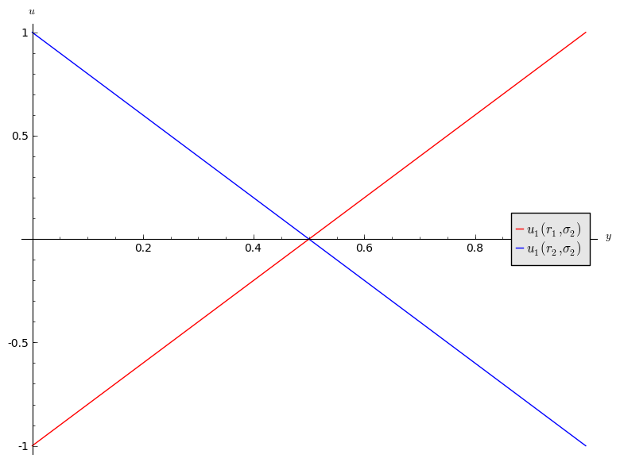
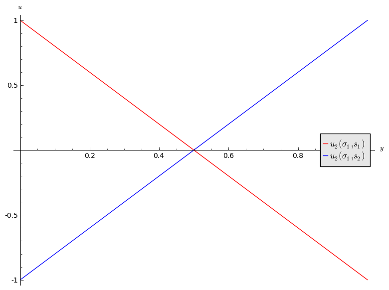
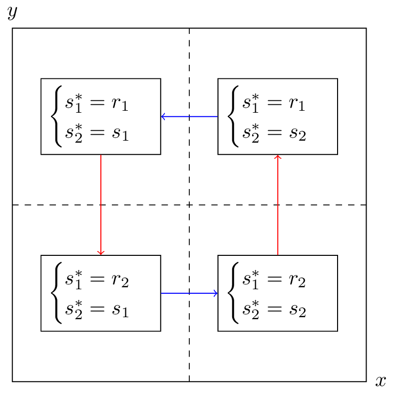

## Recap

In the [previous lecture](Chapter_05-Nash_Equilibria_in_pure_strategies.md)

- The definition of Nash equilibria;
- Identifying Nash equilibria in pure strategies;
- Solving the duopoly game;

This brings us to a very important part of the course. We will now consider equilibria in mixed strategies.

## Recall of expected utility calculation

In the matching pennies game discussed previously:

$$
\begin{pmatrix}
(1,-1)&(-1,1)\\
(-1,1)&(1,-1)
\end{pmatrix}
$$

Recalling [Chapter 2](Chapter_02-Normal_Form_Games.md) a strategy profile of $\sigma_1=(.2,.8)$ and $\sigma_2=(.6,.4)$ implies that player 1 plays heads with probability .2 and player 2 plays heads with probability .6.

We can extend the utility function which maps from the set of pure strategies to $\mathbb{R}$ using _expected payoffs_. For a two player game we have:

$$u_{i}(\sigma_1,\sigma_2)=\sum_{r\in S_1,s\in S_2}\sigma_1(r)\sigma_2(s)u_{i}(r,s)$$

## Obtaining equilibria

Let us investigate the best response functions for the matching pennies game.

If we assume that player 2 plays a mixed strategy $\sigma_2=(y,1-y)$ we have:

$$u_1(r_1,\sigma_2)=2y-1$$
and
$$u_1(r_2,\sigma_2)=1-2y$$

\text{These utilities are shown in Figure \ref{L06-plot01}.}

1. If $y<1/2$ then $r_2$ is a best response for player 1.
2. If $y>1/2$ then $r_1$ is a best response for player 1.
3. If $y=1/2$ then player 1 is indifferent.

If we assume that player 1 plays a mixed strategy $\sigma_1=(x,1-x)$ we have:

$$u_2(\sigma_1,s_1)=1-2x$$
and
$$u_2(\sigma_1,s_2)=2x-1$$

\text{These utilities are shown in Figure \ref{L06-plot02}.}

Thus we have:

1. If $x<1/2$ then $s_1$ is a best response for player 2.
2. If $x>1/2$ then $s_2$ is a best response for player 2.
3. If $x=1/2$ then player 2 is indifferent.

Let us draw both best responses on a single diagram, indicating the best responses in each quadrant \text{as shown in Figure \ref{L06-img01}}. The arrows show the deviation indicated by the best responses.

If either player plays a mixed strategy other than $(1/2,1/2)$ then the other player has an incentive to modify their strategy. Thus the Nash equilibria is:

$$((1/2,1/2),(1/2,1/2))$$

This notion of "indifference" is important and we will now prove an important theorem that will prove useful when calculating Nash Equilibria.

## Equality of payoffs theorem

### Definition of the support of a strategy

---

In an $N$ player normal form game the **support** of a strategy $\sigma\in\Delta S_i$ is defined as:
$$\mathcal{S}(\sigma)=\{s\in S_i\;|\;\sigma(s)>0\}$$

---

I.e. the support of a strategy is the set of pure strategies that are played with non zero probability.

For example, if the strategy set is $\{A,B,C\}$ and $\sigma=(1/3,2/3,0)$ then $\mathcal{S}(\sigma)=\{A,B\}$.

### Theorem of equality of payoffs

---

In an $N$ player normal form game if the strategy profile $(\sigma_i,s_{-i})$ is a Nash equilibria then:

$$u_{i}(\sigma_i,s_{-i})=u_{i}(s,s_{-i})\text{ for all }s\in\mathcal{S}(\sigma_i)\text{ for all }1\leq i\leq N$$

---

### Proof

---

If $|\mathcal{S}(\sigma_i)|=1$ then the proof is trivial.

We assume that $|\mathcal{S}(\sigma_i)|>1$. Let us assume that the theorem is not true so that there exists $\bar s\in\mathcal{S}(\sigma)$ such that

$$u_{i}(\sigma_i,s_{-i})\ne u_{i}(\bar s,s_{-i})$$

Without loss of generality let us assume that:

$$\bar s=\text{argmax}_{s\in\mathcal{S}(\sigma)}u_i(s,s_{-i})$$

Thus we have:

$$\begin{aligned}
u_i(\sigma_i,s_{-i})&=\sum_{s\in\mathcal{S}(\sigma_i)}\sigma_i(s)u(s,s_{-i})\\
&\leq \sum_{s\in\mathcal{S}(\sigma_i)}\sigma_i(s)u(\bar s,s_{-i})\\
&\leq u(\bar s,s_{-i})\sum_{s\in\mathcal{S}(\sigma_i)}\sigma_i(s)\\
&\leq u(\bar s,s_{-i})\\
\end{aligned}$$

Giving:

$$u_{i}(\sigma_i,s_{-i})< u_{i}(\bar s,s_{-i})$$

which implies that $(\sigma_i,s_{-i})$ is not a Nash equilibrium.

---

### Example

Let's consider the matching pennies game yet again. To use the equality of payoffs theorem we identify the various supports we need to try out. As this is a $2\times 2$ game we can take $\sigma_1=(x,1-x)$ and $\sigma_2=(y,1-y)$ and assume that $(\sigma_1,\sigma_2)$ is a Nash equilibrium.

from the theorem we have that $u_1(\sigma_1,\sigma_2)=u_1(r_1,\sigma_2)=u_1(r_2,\sigma_2)$

$$
\begin{aligned}
u_1(r_1,\sigma_2)&=u_2(r_2,\sigma_2)\\
y-(1-y)&=-y+(1-y)\\
y&=1/2
\end{aligned}
$$

Thus we have found player 2's Nash equilibrium strategy by finding the strategy that makes player 1 indifferent. Similarly for player 1:

$$
\begin{aligned}
u_2(\sigma_1,s_1)&=u_2(\sigma_1,s_2)\\
-x+(1-x)&=x-(1-x)\\
x&=1/2
\end{aligned}
$$

Thus the Nash equilibria is:

$$((1/2,1/2),(1/2,1/2))$$

To finish this chapter we state a famous result in game theory:

### Nash's Theorem

Every normal form game with a finite number of pure strategies for each player, has at least one Nash equilibrium.
