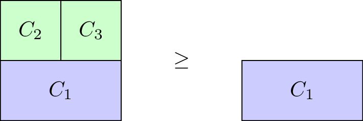

## Recap

In the [previous chapter]({{site.baseurl}}/Content/Chapter_15_Matching_games):

- We defined matching games;
- We described the Gale-Shapley algorithm;
- We proved certain results regarding the Gale-Shapley algorithm.

In this Chapter we'll take a look at another type of game.

## Cooperative Games

In cooperative game theory the interest lies with understanding how coalitions form in competitive situations.

### Definition of a characteristic function game

---

A **characteristic function game** G is given by a pair \\((N,v)\\) where \\(N\\) is the number of players and \\(v:2^{[N]}\to\mathbb{R}\\) is a **characteristic function** which maps every coalition of players to a payoff.

---

Let us consider the following game:

> "3 players share a taxi. Here are the costs for each individual journey:
> - Player 1: 6
> - Player 2: 12
> - Player 3: 42
> How much should each individual contribute?"

This is illustrated.

To construct the characteristic function we first obtain the power set (ie all possible coalitions) \\(2^{\{1,2,3\}}=\{\emptyset,\{1\},\{2\},\{3\},\{1,2\},\{1,3\},\{2,3\},\Omega\}\\) where \\(\Omega\\) denotes the set of all players (\\(\{1,2,3\}\\)).

The characteristic function is given below:

$$
v(C)=\begin{cases}
6,&\text{if }C=\{1\}\\
12,&\text{if }C=\{2\}\\
42,&\text{if }C=\{3\}\\
12,&\text{if }C=\{1,2\}\\
42,&\text{if }C=\{1,3\}\\
42,&\text{if }C=\{2,3\}\\
42,&\text{if }C=\{1,2,3\}\\
\end{cases}
$$

### Definition of a monotone characteristic function game

---

A characteristic function game \\(G=(N,v)\\) is called **monotone** if it satisfies \\(v(C_2)\geq v(C_1)\\) for all \\(C_1\subseteq C_2\\).

---

Our taxi example is monotone, however the \\(G=(3,v_1)\\) with \\(v_1\\) defined as:

$$
v_1(C)=\begin{cases}
6,&\text{if }C=\{1\}\\
12,&\text{if }C=\{2\}\\
42,&\text{if }C=\{3\}\\
10,&\text{if }C=\{1,2\}\\
42,&\text{if }C=\{1,3\}\\
42,&\text{if }C=\{2,3\}\\
42,&\text{if }C=\{1,2,3\}\\
\end{cases}
$$

is not.

### Definition of a superadditive game

---

A characteristic function game \\(G=(N,v)\\) is called **superadditive** if it satisfies \\(v(C_1\cup C_2)\geq v(C_1)+v(C_2).\\)

---

Our taxi example is not superadditive, however the \\(G=(3,v_2)\\) with \\(v_2\\) defined as:

$$
v_2(C)=\begin{cases}
6,&\text{if }C=\{1\}\\
12,&\text{if }C=\{2\}\\
42,&\text{if }C=\{3\}\\
18,&\text{if }C=\{1,2\}\\
48,&\text{if }C=\{1,3\}\\
55,&\text{if }C=\{2,3\}\\
80,&\text{if }C=\{1,2,3\}\\
\end{cases}
$$

is.

## Shapley Value

When talking about a solution to a characteristic function game we imply a payoff vector \\(\lambda\in\mathbb{R}_{\geq 0}^{N}\\) that divides the value of the grand coalition between the various players. Thus \\(\lambda\\) must satisfy:

$$\sum_{i=1}^N\lambda_i=v(\Omega)$$

Thus one potential solution to our taxi example would be \\(\lambda=(14,14,14)\\). Obviously this is not ideal for player 1 and/or 2: they actually pay more than they would have paid without sharing the taxi!

Another potential solution would be \\(\lambda=(6,6,30)\\), however at this point sharing the taxi is of no benefit to player 1. Similarly \\((0,12,30)\\) would have no incentive for player 2.

To find a "fair" distribution of the grand coalition we must define what is meant by "fair". We require four desirable properties:

- Efficiency;
- Null player;
- Symmetry;
- Additivity.

### Definition of efficiency

---

For \\(G=(N,v)\\) a payoff vector \\(\lambda\\) is **efficient** if:

$$\sum_{i=1}^N\lambda_i=v(\Omega)$$

---

### Definition of null players

---

For \\(G(N,v)\\) a payoff vector possesses the **null player property** if \\(v(C\cup i)=v(C)\\) for all \\(C\in 2^{\Omega}\\) then:

$$x_i=0$$

---

### Definition of symmetry

---

For \\(G(N,v)\\) a payoff vector possesses the **symmetry property** if \\(v(C\cup i)=v(C\cup j)\\) for all \\(C\in 2^{\Omega}\setminus\{i,j\}\\) then:

$$x_i=x_j$$

---

### Definition of additivity

---

For \\(G_1=(N,v_1)\\) and \\(G_2=(N,v_2)\\) and \\(G^+=(N,v^+)\\) where \\(v^+(C)=v_1(C)+v_2(C)\\) for any \\(C\in 2^{\Omega}\\). A payoff vector possesses the **additivity property** if:

$$x_i^{(G^+)}=x_i^{(G_1)}+x_i^{(G_2)}$$

---

We will not prove in this course but in fact there is a single payoff vector that satisfies these four properties. To define it we need two last definitions.

### Definition of predecessors

---

If we consider any permutation \\(\pi\\) of \\([N]\\) then we denote by \\(S_\pi(i)\\) the set of **predecessors** of \\(i\\) in \\(\pi\\):

$$S_\pi(i)=\{j\in[N]\;|\;\pi(j)<\pi(i)\}$$

---

For example for \\(\pi=(1,3,4,2)\\) we have \\(S_\pi(4)=\{1,3\}\\).

### Definition of marginal contribution

---

If we consider any permutation \\(\pi\\) of \\([N]\\) then the **marginal contribution** of player \\(i\\) with respect to \\(\pi\\) is given by:

$$\Delta_\pi^G(i)=v(S_{\pi}(i)\cup i)-v(S_{\pi}(i))$$

---

We can now define the **Shapley value** of any game \\(G=(N,v)\\).

### Definition of the Shapley value

---

Given \\(G=(N,v)\\) the **Shapley value** of player \\(i\\) is denoted by \\(\phi_i(G)\\) and given by:

$$\phi_i(G)=\frac{1}{N!}\sum_{\pi\in\Pi_n}\Delta_\pi^G(i)$$

---

As an example here is the Shapley value calculation for our taxi sharing game:

For \\(\pi=(1,2,3)\\):

$$\begin{aligned}
\Delta_{\pi}^G(1)&=6\\
\Delta_{\pi}^G(2)&=6\\
\Delta_{\pi}^G(3)&=30\\
\end{aligned}$$

For \\(\pi=(1,3,2)\\):

$$\begin{aligned}
\Delta_{\pi}^G(1)&=6\\
\Delta_{\pi}^G(2)&=0\\
\Delta_{\pi}^G(3)&=36\\
\end{aligned}$$

For \\(\pi=(2,1,3)\\):

$$\begin{aligned}
\Delta_{\pi}^G(1)&=0\\
\Delta_{\pi}^G(2)&=12\\
\Delta_{\pi}^G(3)&=30\\
\end{aligned}$$

For \\(\pi=(2,3,1)\\):

$$\begin{aligned}
\Delta_{\pi}^G(1)&=0\\
\Delta_{\pi}^G(2)&=12\\
\Delta_{\pi}^G(3)&=30\\
\end{aligned}$$

For \\(\pi=(3,1,2)\\):

$$\begin{aligned}
\Delta_{\pi}^G(1)&=0\\
\Delta_{\pi}^G(2)&=0\\
\Delta_{\pi}^G(3)&=42\\
\end{aligned}$$

For \\(\pi=(3,2,1)\\):

$$\begin{aligned}
\Delta_{\pi}^G(1)&=0\\
\Delta_{\pi}^G(2)&=12\\
\Delta_{\pi}^G(3)&=42\\
\end{aligned}$$

Using this we obtain:

$$\phi(G)=(2,5,35)$$

Thus the fair way of sharing the taxi fare is for player 1 to pay 2, player 2 to pay 5 and player 3 to pay 35.
