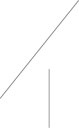
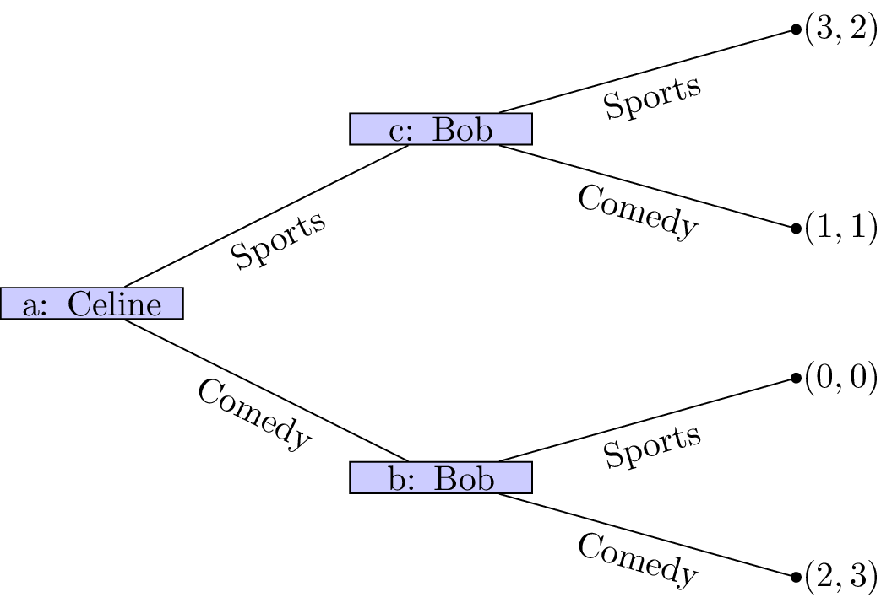

# OR 3: Chapter 1 - Introduction to game theory
## Introduction

Let us consider the very simple situation where **you** decide where to meet your **friends**. You have some information about their behaviour:

- 20% of the time they go to coffee house A;
- 80% of the time they go to coffee house B.

If you wanted to maximise your chance of meeting your friends: what should you do?

The tree \text{in Figure \ref{L01-img01}} shows that if **you** were to choose your location first it would be in your interest of choosing coffee house B. This gives you an 80% chance of being in the same location as your **friends**.

In general these sorts of decisions are not at the mercy of chance. **You** would probably choose to go to coffee house A or B and simply let your friends know where you are so that they could make an informed decision. This consecutive making of decisions is a type of game \text{(as shown in Figure \ref{L01-img02})}.

In this game the outcome (whether or not your friends and you have a coffee together) depends on the actions of all the players.

### 2/3rds of the average game

Let us consider another type of game:

1. Every player must write a whole number between 0 and 100 on the provided sheet.

2. The winner of the game will be the player whose number is closest to 2/3rd of the average of all the numbers written by all the players.

## Extensive Form Games

We will now return to the tree diagrams drawn previously. In game theory trees are used to represent a type of game called: **extensive form games**.

### Definition of an Extensive form game

---

An $N$ player extensive form game **of complete information** consists of:

1. A finite set of $N$ players;
2. A rooted tree (which we refer to as the _game tree_);
3. Each leaf of the tree has an $N$-tuple of payoffs;

---

### Example: Battle of the sexes

Let's consider the following game.

> Two friends must decide what movie to watch at the cinema. Bob would like to watch a comedy and Celine would like to watch a sports movie. Importantly they would both rather spend their evening together then apart.

The game as well as the utilities of Bob and Celine \text{are shown in Figure \ref{L01-img03}}:

If we assume that this is the order with which decisions take place it should be relatively straightforward to predict what will happen:

1. Bob sees that no matter what he picks Celine will pick the same type of movie;
2. Bob can thus pick a comedy to ensure that he gets a slightly higher utility.

(This is actually using a process called **backward induction** but we'll see that formally a bit later.)

Of course \text{as shown in Figure \ref{L01-img04}} we can simply represent this game in a different way (remember that in the above description we did not mention who would be making the initial decision).

In this case it should again be relatively straightforward to predict what will happen:

1. Celine sees that no matter what she picks Bob will pick the same type of movie;
2. Celine can thus pick sports to ensure that she gets a slightly higher utility.

The main assumption we are making here is concerned with the amount of information available to both players at different points of the game. In both cases we have here assumed that the information available at nodes **b** and **c** is different. This is not always the case.

## Information sets

### Definition of an Information set

---

Two nodes of a game tree are said to be part of the same information set if the player at that node cannot differentiate between them.

---

We represent nodes being part of the same information set using a dashed line\text{ (as shown in Figure \ref{L01-img05})}. In our example with Celine and Bob if both players must decide on a movie without knowing what the other will do we see that nodes **b** and **c** now have the same information set.

It is now a lot more difficult to try and predict the outcome of this situation.
