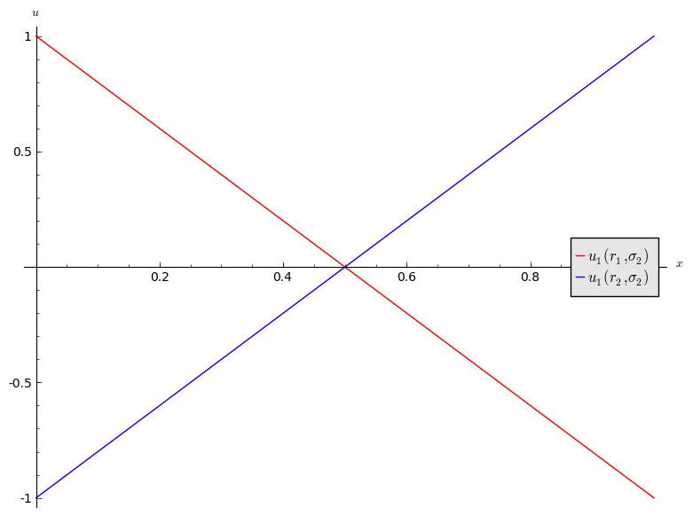
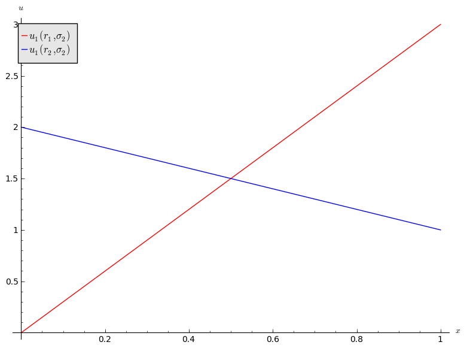
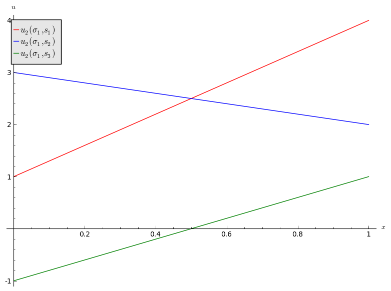
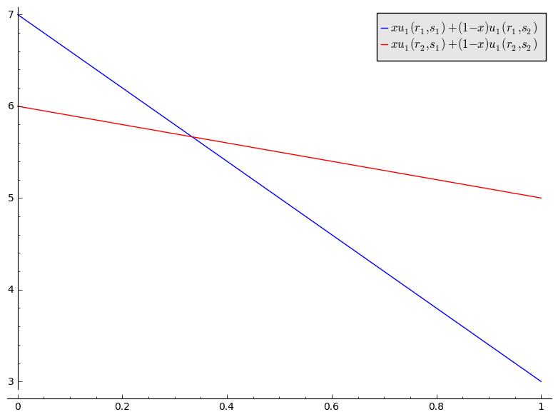

# OR 3: Chapter 4 - Best responses

## Recap

In the [previous lecture](Chapter_03-Dominance.pdf) we discussed:

- Predicting rational behaviour using dominated strategies;
- The CKR;

We did discover certain games that did not have any dominated strategies.

## Best response functions

### Definition of a best response

---

In an $N$ player normal form game. A strategy $s^*$ for player $i$ is a best response to some strategy profile $s_{-i}$ if and only if $u_i(s^*,s_{-i})\geq u_{i}(s,s_{-i})$ for all $s\in S_i$.

---

We can now start to predict rational outcomes in pure strategies by identifying all best responses to a strategy.

$$\begin{pmatrix}
(1,3)&(4,2)&(2,2)\\
(4,0)&(0,3)&(4,1)\\
(2,5)&(3,4)&(5,6)
\end{pmatrix}
$$

We will underline the best responses for each strategy giving ($r_i$ is underlined if it is a best response to $s_j$ and vice versa):

$$\begin{pmatrix}
(1,\underline{3})&(\underline{4},2)&(2,2)\\
(\underline{4},0)&(0,\underline{3})&(4,1)\\
(2,5)&(3,4)&(\underline{5},\underline{6})
\end{pmatrix}
$$

We see that $(r_1,s_1)$ represented a pair of best responses. What can we say about the long term behaviour of this game?

## Best responses against mixed strategies

We can identify best responses against mixed strategies. Let us take a look at the matching pennies game:

$$\begin{pmatrix}
(1,-1)&(-1,1)\\
(-1,1)&(1,-1)
\end{pmatrix}$$

If we assume that player 2 plays a mixed strategy $\sigma_2=(x,1-x)$ we have:

$$u_1(r_1,\sigma_2)=2x-1$$

and

$$u_1(r_2,\sigma_2)=1-2x$$

\text{In Figure \ref{L04-plot01} we see that:}

1. If $x<1/2$ then $r_2$ is a best response for player 1.
2. If $x>1/2$ then $r_1$ is a best response for player 1.
3. If $x=1/2$ then player 1 is indifferent.

Let us repeat this exercise for the battle of the sexes game.

$$\begin{pmatrix}
(3,2)&(0,0)\\
(1,1)&(2,3)
\end{pmatrix}$$

If we assume that player 2 plays a mixed strategy $\sigma_2=(x,1-x)$ we have:

$$u_1(r_1,\sigma_2)=3x$$

and

$$u_1(r_2,\sigma_2)=2-x$$

\text{In Figure \ref{L04-plot02} we see that:}

1. If $x<1/2$ then $r_2$ is a best response for player 1.
2. If $x>1/2$ then $r_1$ is a best response for player 1.
3. If $x=1/2$ then player 1 is indifferent.

## Connection between best responses and dominance

### Definition of the undominated strategy set

---

In an $N$ player normal form game, let us define the undominated strategy set $UD_i$:

$$UD_i=\{s\in S_i\;|\; \text{s is not strictly dominated}\}$$

---

If we consider the following game:

$$\begin{pmatrix}
(3,3)&(7,2)&(5,1)\\
(5,1)&(6,3)&(7,-1)
\end{pmatrix}$$

We have:

$$UD_1=\{r_1,r_2\}$$
$$UD_2=\{s_1,s_2\}$$

### Definition of the best responses strategy set

---

In an $N$ player normal form game, let us define the best responses strategy set $B_i$:

$$B_i=\{s\in S_i\;|\; \exists\;\sigma\in\Delta S_{-i}\text{ such that }s \text{ is a best response to }\sigma\}$$

---

In other words $B_i$ is the set of functions that are best responses to some strategy profile in $S_{-i}$.

Let us try to identify $B_2$ for the above game. Let us assume that player 1 plays $\sigma_1=(x,1-x)$. This gives:

$$u_2(\sigma_1,s_1)=1+2x$$
$$u_2(\sigma_1,s_2)=3-x$$
$$u_2(\sigma_1,s_3)=2x-1$$

\text{Figure \ref{L04-plot03} plots these utilities.}

We see that $s_3$ is never a best response for player 2:

$$B_2=\{s_1,s_2\}$$

We will now attempt to identify $B_1$ for the above game. Let us assume that player two plays $\sigma_2=(x,y,1-x-y)$. This gives:

$$u_1(r_1,\sigma_2)=xu_1(r_1,s_1)+yu_2(r_1,s_2)+(1-x-y)u_3(r_1,s_3)$$
$$u_1(r_2,\sigma_2)=xu_1(r_2,s_1)+yu_2(r_2,s_2)+(1-x-y)u_3(r_2,s_3)$$

However as noted earlier $s_3$ is dominated by $s_2$ so:

$$u_1(r_1,\sigma_2)< xu_1(r_1,s_1)+u_2(r_1,s_2)(1-x)=7-4x$$
$$u_1(r_2,\sigma_2)< xu_1(r_2,s_1)+u_2(r_2,s_2)(1-x)=6-x$$

\text{Figure \ref{L04-plot04} shows these upper bounds.}

We see that $r_1$ and $r_2$ are best responses for player 1 (however $r_3$ cannot be as for any value of $y$ the corresponding curves would be below the curves shown\text{ in Figure \ref{L04-plot04}}):

$$B_1=\{r_1,r_2\}$$

We have seen in our example that $B_i=UD_i$. This leads us to two Theorems (the proofs are omitted).

### Theorem of equality in 2 player games

---

In a 2 player normal form game $B_i=UD_i$ for all $i\in\{1,2\}$.

---

This is however not always the case:

### Theorem of inclusion in $N$ player games

---

In an $N$ player normal form game $B_i\subseteq UD_i$ for all $1 \leq i\leq n$.

---
