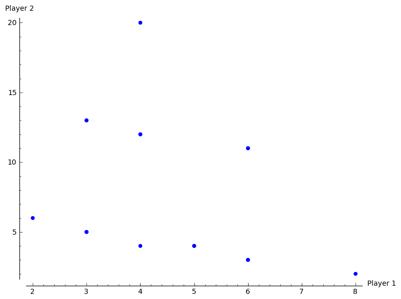
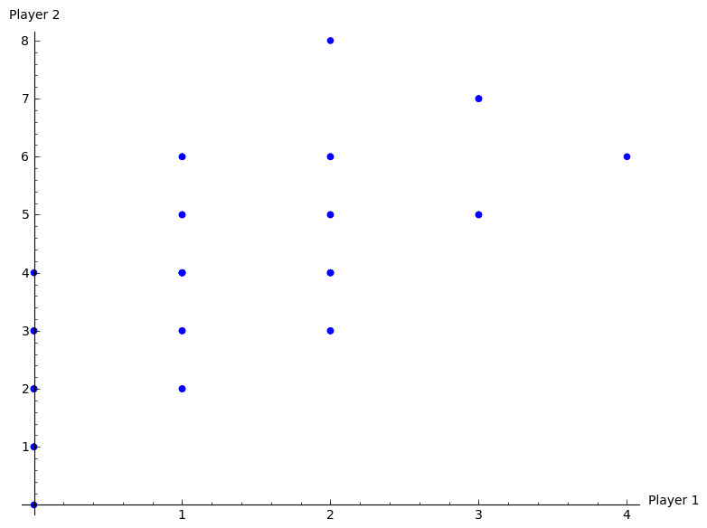

# OR 3: Chapter 9 - Finitely Repeated Games

## Recap

In the [previous chapter](Chapter_08-Subgame_Perfection.md):

- We looked at the connection between games in normal form and extensive form;
- We defined a subgame;
- We defined a refinement of Nash equilibrium: subgame perfect equilibrium.

In this chapter we'll start looking at instances where games are repeated.

## Repeated games

In game theory the term **repeated game** is well defined.

### Definition of a repeated game

---

A repeated game is played over discrete time periods. Each time period is index by $0<t\leq T$ where $T$ is the total number of periods.

In each period $N$ players play a static game referred to as the **stage game** independently and simultaneously selecting actions.

Players make decisions in full knowledge of the **history** of the game played so far (ie the actions chosen by each player in each previous time period).

The payoff is defined as the sum of the utilities in each stage game for every time period.

---

As an example let us use the Prisoner's dilemma as the stage game (so we are assuming that we have 2 players playing repeatedly):

$$
\begin{pmatrix}
(2,2)&(0,3)\\
(3,0)&(1,1)
\end{pmatrix}
$$

All possible outcomes to the repeated game given $T=2$ are shown\text{ in Figure \ref{L09-plot01}}.

When we discuss strategies in repeated games we need to be careful.

### Definition of a strategy in a repeated game

---

A repeated game strategy must specify the action of a player in a given stage game given the entire history of the repeated game.

---

For example in the repeated prisoner's dilemma the following is a valid strategy:

> "Start to cooperate and in every stage game simply repeat the action used by your opponent in the previous stage game."

Thus if both players play this strategy both players will cooperate throughout getting (in the case of $T=2$) a utility of 4.

## Subgame perfect Nash equilibrium in repeated games

### Theorem of a sequence of stage Nash profiles

---

For any repeated game, any sequence of stage Nash profiles gives the outcome of a subgame perfect Nash equilibrium.

---

Where by stage Nash profile we refer to a stationary profile that is a Nash Equilibrium in the stage game.

### Proof

---

If we consider the strategy given by:

> "Player $i$ should play strategy $\tilde s^{(k)}_i$ regardless of the play of any previous strategy profiles."

where $\tilde s^{(k)}_i$ is the strategy played by player $i$ in any stage Nash profile. The $k$ is used to indicate that all players play strategies from the same stage Nash profile.

Using backwards induction we see that this strategy is a Nash equilibrium. Furthermore it is a stage Nash profile so it is a Nash equilibria for the last stage game which is the last subgame. If we consider (in an inductive way) each subsequent subgame the result holds.

---

### Example

Consider the following stage game:

$$\begin{pmatrix}
(2,3)&(0,2)&(1,4)\\
(0,1)&(1,2)&(0,0)\\
\end{pmatrix}$$

The plot\text{ shown in Figure \ref{L09-plot02}} shows the various possible outcomes of the repeated game for $T=2$.

If we consider the two pure equilibria $(r_1,s_3)$ and $(r_2,s_2)$, we have 4 possible outcomes that correspond to the outcome of a subgame perfect Nash equilibria:

$$(r_1r_1,s_3s_3)\text{ giving utility vector: }(2,8)$$
$$(r_1r_2,s_3s_2)\text{ giving utility vector: }(2,6)$$
$$(r_2r_1,s_2s_3)\text{ giving utility vector: }(2,6)$$
$$(r_2r_2,s_2s_2)\text{ giving utility vector: }(2,4)$$

Importantly, not all subgame Nash equilibria outcomes are of the above form.

## Reputation in repeated games

By definition all subgame Nash equilibria **must** play a stage Nash profile in the last stage game. However can a strategy be found that does not play a Nash profile in earlier games?

Considering the above game, let us look at this strategy:

> "Play $(r_1,s_1)$ in the first period and then, as long as P2 cooperates play $(r_2,s_3)$ in the second period. If P2 deviates from $s_1$ in the first period then play $(r_2,s_2)$ in the second period."

Firstly this strategy gives the utility vector: $(3,8)$.

1. Is this strategy profile a Nash equilibrium (for the entire game)?

- Does player 1 have an incentive to deviate?

No any other strategy played in any period would give a lower payoff.

- Does player 2 have an incentive to deviate?

If player 2 deviates in the first period, he/she can obtain 4 in the first period but will obtain 2 in the second. Thus a first period deviation increases the score by 1 but decreases the score in the second period by 2. Thus player 2 does not have an incentive to deviate.

2. Finally to check that this is a subgame perfect Nash equilibrium we need to check that it is an equilibrium for the whole game as well as all subgames.

- We have checked previously that it is an equilibrium for the entire game.
- It is also subgame perfect as the profile dictates a stage Nash profile in the last stage.
