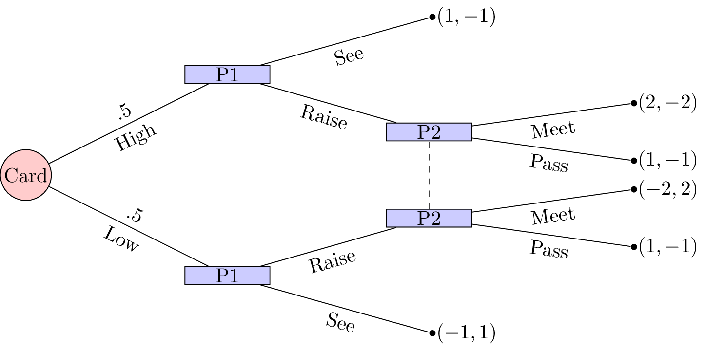
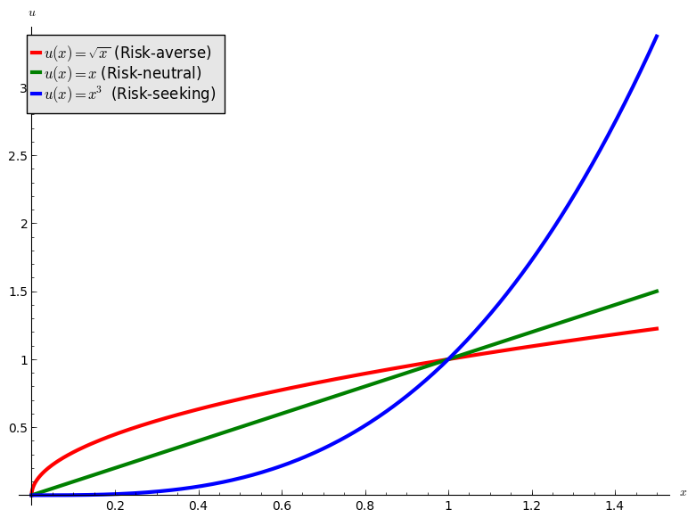
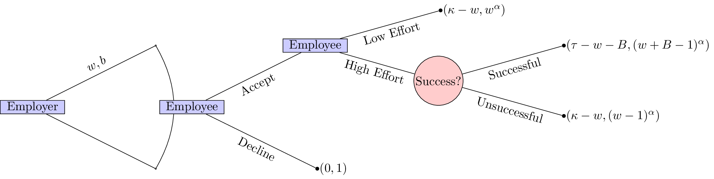
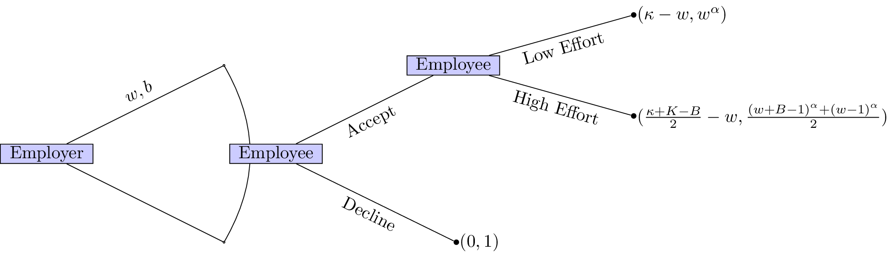

# OR 3: Chapter 13 - Random events and incomplete information

## Recap

In the [previous chapter](Chapter_12_Nash_equilibrium_and_Evolutionary_stable_strategies.pdf):

- We considered pairwise contest population games;
- We proved a result showing the connection between ESS and NE.

In this chapter we will take a look at how to model games with incomplete information and random events.

## Representing incomplete information in extensive form games

Game with incomplete information represent situation where the players do not possess aexact knowledge of the environment. This is represented by associating probabilities to various states. We show this on game trees using red circles to represent decisions made by "nature" where we can consider "nature" as a player although not a strategic one.

If we recall the first game tree we considered in [Chapter 1](Chapter_01-Introduction.pdf) we had already done this to some extent:

Let us consider a slightly more complicated game.

> "Two players play a card game. They each put a dollar in a pot. Player 1 is dealt a card that is either *high* or *low* with equal probability. Player1 observes the card but player 2 does not. Player 1 may _see_ or _raise_. If player 1 _sees_ then the card is shown and player 1 takes the dollar if the card if **high** or player 2 takes the dollar. If player 1 _raises_, player 1 adds a dollar to the pot. Player 2 can then _pass_ or _meet_. If player 2 _passes_ then player 1 takes the pot. Otherwise, player 2 adds a dollar to the pot. If player 1's card is **high** then player 1 takes the pot else player 2 takes the pot."

This game is represented below:

To solve this game we can (as in [Chapter 8](Chapter_08-Subgame_Perfection.pdf)) obtain the corresponding normal form game by taking expected utilities over the moves of nature.

For the above game we have $S_1=\{\text{SeeRaise},\text{SeeSee},\text{RaiseRaise},\text{RaiseSee}\}$ and $S_2=\{\text{Meet},\text{Pass}\}$ and the normal form representation is:

$$\begin{pmatrix}
(-1/2,1/2)&(1,-1)\\
(0,0)&(0,0)\\
(0,0)&(1,-1)\\
(1/2,-1/2)&(0,0)
\end{pmatrix}$$

In this game we see that $\text{SeeSee}$ is dominated by any mixed strategy with support: $\{\text{RaiseRaise},\text{RaiseSee}\}$. Similarly $\text{SeeRaise}$ is not a best response to any strategy of player 2 that plays $\text{Meet}$ with non zero probability. Thus we have  $\sigma_1=(0,0,x,1-x)$. Using the equality of payoffs theorem we have:

$$
\begin{aligned}
u_2(\sigma_1,\text{Meet})&=u_2(\sigma_1,\text{Pass})\\
(x-1)/2&=-x\\
x&=1/3
\end{aligned}
$$

Using the Equality of Payoffs theorem we get that the Nash equilibrium is $\sigma_1=(0,0,2/3,1/3)$ and $\sigma_2=(2/3,1/3)$. I.e. player 1 should always raise if the card is high and bluff with probability $1/3$ if the card is low.

## Utilities

When considering games with uncertainty it is particularly relevant to consider some basic utility theory. Consider the following game:

This is a 1 player game where a player must choose whether or not to flip a coin. If the coin is flipped and lands on "Heads" then the player wins £10, if the coin lands on "Tails" then the player wins nothing. If the player chooses to not flip a coin then the player wins £4.

With such small sums of money involved it is quite likely that the player would choose to flip the coin (afterall the expected value of flipping the coin is £5. If we changed the game slightly so that it was now in terms of **millions** of pounds surely the player should just take the £4 million on offer?

This perception is due to the fact that the percieved gain from 0 to £4 million is much larger than the percieved gain from £4 million to £10 million. This can be modelled mathematically using convex and concave increasing functions:

- "Risk averse": a concave utility function.
- "Risk neutral": a linear function.
- "Risk seeking": a convex function.

This is shown:

If we use $u=\sqrt(x)$ as the utility function in the coin flip game we see that the analytical solution would indeed be to not flip. We will now take a look at this in a bit more detail with a well known game.

## Principal agent game

Consider a game with two players. The first player is an employer and the second a potential employee. The employer must decide on two parameters:

- A wage value: $w$;
- A bonus value: $B$.

The potential employee must then make two decisions:

- Whether or not to accept the job;
- If the job is accepted to either put in a high level of effort or a low level of effort.

The success of the project that requires the employee is as follows:

- If the employee puts in a high level of effort the project will be succesful with probability $1/2$;
- If the employee puts in a low level of effort the project will be unsussesful.

The monetary gain to the employer is as follows:

- If the employee does not take the job the utility is 0.
- If the project is succesful: $\tau$;
- If the project is unsuccesful: $\kappa$.

The monetary gain to the employee is as follows:

- If the job offer is not accepted: 0;
- If the project is succesful: $w+B-1$ (the lost gain corresponds to the effort);
- If the project is unsuccesful despite a high level of effort: $w-1$ (the lost gain corresponds to the effort);
- If the project is unsuccesful because of a low level of effort: $w$.

We furthermore assume that the utility function of the employer is simply $u(x)=x$ while the utility function to the potential employee is of the form $u(x)=x^{\alpha}$ for $0<\alpha<1$ (i.e. the potential employee is risk averse). 

The extensive form of the game is given:

Immediately we see that this game is trivial if $\kappa<\omega$ and $\tau<\omega+B$. Furthermore it seems sensible to only consider $\tau>\kappa$.

We will solve this game using backward induction. The first step:

If the employer would like a high level of effort he should set $w,B$ such that:

$$\frac{(w+B-1)^\alpha+(w-1)^\alpha}{2}\geq w^\alpha$$

This ensures that the employee will put in a high level of effort. Furthermore it is in the employers interest to ensure that the employee accepts the job (we assume here that $\frac{\kappa+\tau+B}{2}\geq w$):

$$\frac{(w+B-1)^\alpha+(w-1)^\alpha}{2}\geq 1$$

This second inequality ensures that the employee accepts the position. Given that the position is accepted the employer would like to in fact minimise $w,B$ thus we have:

$$\frac{(w+B-1)^\alpha+(w-1)^\alpha}{2}=1$$

Thus we have:

$$w^\alpha\leq 1$$

however we assume that $w\geq 1$ (so that the "wage is worth the effort") so we in fact have $w=1$. This then gives: $B=2^{1/\alpha}$. The expected utilities are then:

- Employer: $\frac{\kappa+\tau-2^{1/\alpha}}{2}-1$;
- Employee: 1.

Note that the employer's utility is an increasing function in $\alpha$. As the potential employee becomes more and more risk neutral the employer does not need to offer a high bonus to incite a high level of effort.
