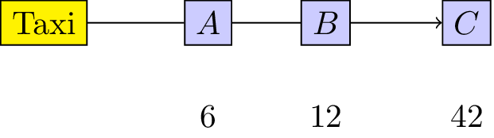
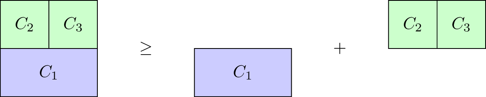

# OR 3: Chapter 15 - Matching games

## Recap

In the [previous chapter](Chapter_15_Matching_games.html):

- We defined matching games;
- We described the Gale-Shapley algorithm;
- We proved certain results regarding the Gale-Shapley algorithm.

In this Chapter we'll take a look at another type of game.

## Cooperative Games

In cooperative game theory the interest lies with understanding how coalitions form in competitive situations.

### Definition

---

A **characteristic function game** G is given by a pair $(n,v)$ where $n$ is the number of players and $v:2^{[n]}\to\mathbb{R}$ is a **characteristic function** which maps every coalition of players to a payoff.

---

Let's consider the following game:

> "3 players must share a taxi. Here are the costs for each individual journey:
> - Player 1: 6
> - Player 2: 12
> - Player 3: 42
> "

This is illustrated below:

To construct the characteristic function we first obtain the power set (ie all possible coalitions) $2^{\{1,2,3\}}=\{\emptyset,\{1\},\{2\},\{3\},\{1,2\},\{1,3\},\{2,3\},\Omega\}$ where $\Omega$ denotes the set of all players ($\{1,2,3\}$).

The characteristic function is given below:

$$
v(S)=\begin{cases}
6,&\text{if }S=\{1\}\\
12,&\text{if }S=\{2\}\\
42,&\text{if }S=\{3\}\\
12,&\text{if }S=\{1,2\}\\
42,&\text{if }S=\{1,3\}\\
42,&\text{if }S=\{2,3\}\\
42,&\text{if }S=\{1,2,3\}\\
\end{cases}
$$

### Definition

---

A characteristic function game $G=(n,v)$ is called **monotone** is it satisfies $v(S_2)\geq v(S_1)$ for all $S_1\subseteq S_2$.

---

Our taxi example is monotone, however the $G=(3,v_1)$ with $v_1$ defined as:

$$
v_1(S)=\begin{cases}
6,&\text{if }S=\{1\}\\
12,&\text{if }S=\{2\}\\
42,&\text{if }S=\{3\}\\
10,&\text{if }S=\{1,2\}\\
42,&\text{if }S=\{1,3\}\\
42,&\text{if }S=\{2,3\}\\
42,&\text{if }S=\{1,2,3\}\\
\end{cases}
$$

is not.

### Definition

---

A characteristic function game $G=(n,v)$ is called **superadditive** if it satisfies $v(S_1\cup S_2)\geq v(S_1)+v(S_2).$

---

Our taxi example is not superadditive, however the $G=(3,v_2)$ with $v_2$ defined as:

$$
v_2(S)=\begin{cases}
6,&\text{if }S=\{1\}\\
12,&\text{if }S=\{2\}\\
42,&\text{if }S=\{3\}\\
18,&\text{if }S=\{1,2\}\\
48,&\text{if }S=\{1,3\}\\
55,&\text{if }S=\{2,3\}\\
80,&\text{if }S=\{1,2,3\}\\
\end{cases}
$$

is.

## Shapley Value

When talking about a solution to a characteristic function game we imply a payoff vector $x\in\mathbb{R}_{\geq 0}^{n}$ that divides the value of the grand coalition between the various players. Thus $x$ must satisfy:

$$\sum_{i=1}^nx_i=v([n])$$

Thus one potential solution to our taxi example would be $x=(14,14,14)$. Obviously this is not ideal for player 1 and/or 2: they actually pay more than they would have paid without sharing the taxi!

Another potential solution would be $x=(6,6,30)$, however at this point sharing the taxi is of no benefit to player 1. Similarly $(0,12,30)$ would have no incentive for player 2.

To find a "fair" distribution of the grand coalition we must define what is meant by "fair". We require four desirable properties:

- Efficiency;
- Null player;
- Symmetry;
- Additivity.

### Definition

---

For $G=(n,v)$ a payoff vector $x$ is **efficient** if:

$$\sum_{i=1}^nx_i=v([n])$$

---

### Definition

---

For $G(n,v)$ a payoff vector possesses the **null player property** if $v(S\cup i)=v(S)$ for all $S\in 2^{[n]}$ then:

$$x_i=0$$

---

### Definition

---

For $G(n,v)$ a payoff vector possesses the **symmetry property* if $v(S\cup i)=v(S\cup j)$ for all $S\in 2^{[n]}\setminus\{i,j\}$ then:

$$x_i=x_j$$

---

### Definition

---

For $G_1=(n,v_1)$ and $G_2=(n,v_2)$ and $G^+=(n,v^+)$ where $v^+(S)=v_1(S)+v_2(S)$ for any $S\in 2^{[n]}$. A payoff vector possesses the **additivity property** if:

$$x_i^{(G^+)}=x_i^{(G_1)}+x_i^{(G_2)}$$

---

We will not prove the following in this course but in fact there is a single payoff vector that satisfies these four properties. To define it we need two last definitions.

### Definition

---

If we consider any permutation $\pi$ of $[n]$ then we denote by $S_\pi(i)$ the set of predecessors of $i$ in $\pi$:

$$S_\pi(i)=\{j\in[n]\;|\;\pi(j)<\pi(i)\}$$

---

For example for $\pi=(1,3,4,2)$ we have $S_\pi(4)=\{1,3\}$.

### Definition

---

If we consider any permutation $\pi$ of $[n]$ then the marginal contribution of player $i$ with respect to $\pi$ is given by:

$$\Delta_\pi^G(i)=v(S_{\pi}(i)\cup i)-v(S_{\pi}(i))$$

---

We can now define the **Shapley value** of any game $G=(n,v)$.

### Definition

---

Given $G=(n,v)$ the **Shapley value** of player $i$ is denoted by $\phi_i(G)$ and given by:

$$\phi_i(G)=\frac{1}{n!}\sum_{\pi\in\Pi_n}\Delta_\pi^G(i)$$

---

As an example here is the Shapley value calculation for our taxi sharing game:

For $\pi=(1,2,3)$:

$$\begin{aligned}
\Delta_{\pi}^G(1)&=6\\
\Delta_{\pi}^G(2)&=6\\
\Delta_{\pi}^G(3)&=30\\
\end{aligned}$$

For $\pi=(1,3,2)$:

$$\begin{aligned}
\Delta_{\pi}^G(1)&=6\\
\Delta_{\pi}^G(2)&=0\\
\Delta_{\pi}^G(3)&=36\\
\end{aligned}$$

For $\pi=(2,1,3)$:

$$\begin{aligned}
\Delta_{\pi}^G(1)&=0\\
\Delta_{\pi}^G(2)&=12\\
\Delta_{\pi}^G(3)&=30\\
\end{aligned}$$

For $\pi=(2,3,1)$:

$$\begin{aligned}
\Delta_{\pi}^G(1)&=0\\
\Delta_{\pi}^G(2)&=12\\
\Delta_{\pi}^G(3)&=30\\
\end{aligned}$$

For $\pi=(3,1,2)$:

$$\begin{aligned}
\Delta_{\pi}^G(1)&=0\\
\Delta_{\pi}^G(2)&=0\\
\Delta_{\pi}^G(3)&=42\\
\end{aligned}$$

For $\pi=(3,2,1)$:

$$\begin{aligned}
\Delta_{\pi}^G(1)&=0\\
\Delta_{\pi}^G(2)&=12\\
\Delta_{\pi}^G(3)&=42\\
\end{aligned}$$

Using this we obtain:

$$\phi(G)=(2,5,35)$$

Thus the fair way of sharing the taxi fare is for player 1 to pay 1, player 2 to pay 5 and player 3 to pay 35.
