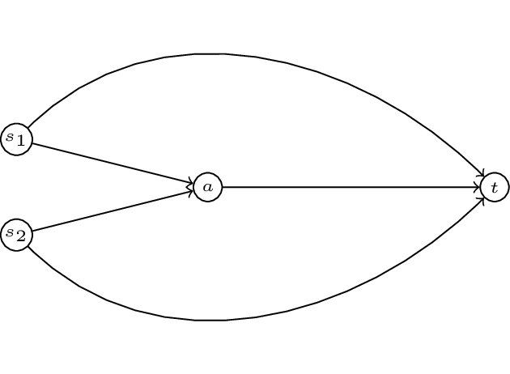
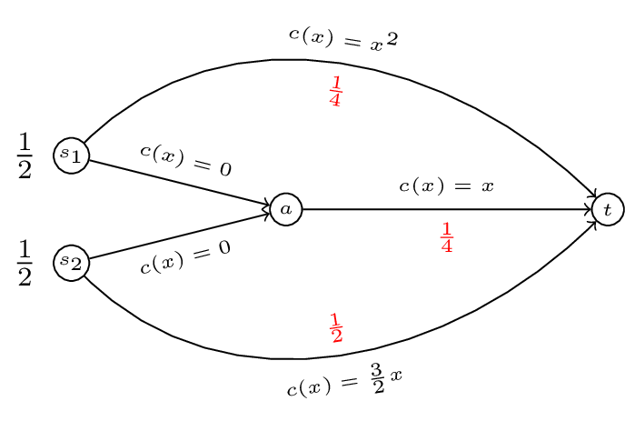
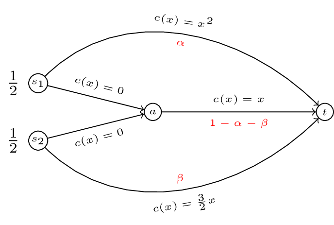

# OR 3: Chapter 17 - Routing Games

## Recap

In the [previous chapter](Chapter_16_Cooperative_games.html):

- We defined characteristic function games;
- We defined the Shapley value.

In this Chapter we'll take a look at another type of game that allows us to model congestion.

## Routing games

Game theory can be used to model congestion in a variety of settings:

- Road traffic;
- Data traffic;
- Patient flow in healthcare;
- Strategies in basketball.

The type of game used is referred to as a **routing game**.

### Definition

---

A **routing game** $(G,r,c)$ is defined on a graph $G=(V,E)$ with defined set of sources $s_i$ and sinks $t_i$. Each source-sink pair corresponds to a set of traffic $r_i$ that must travel along the edges of $G$ from $s_i$ to $t_i$. Every edge $e$ of $G$ has associated to it a nonnegative, continuous and nondecreasing cost function (also called latency function) $c_e$.

---

An example of such a game is given below:

In this game we have two **commodoties** with two sources: $s_1$ and $s_2$ and a single sink $t$. To complete our definition of a routing game we require a quantity of traffic, let $r=(1/2,1/2)$. We also require a set of cost functions $c$. Let:

$$\begin{aligned}
c_{s_1a}&=0\\
c_{s_2a}&=0\\
c_{s_1t}&=x^2\\
c_{s_2t}&=\frac{x}{2}x\\
c_{at}&=x\\
\end{aligned}$$

We represent all this diagrammatically:

### Definition

---

For any given $(G,r,c)$ we denote by $\mathcal{P}_i$ the set of paths available to commodity $i$.

---

For our example we have:

$$\mathcal{P}_1=\{s_1a-at,s_1t\}$$

and

$$\mathcal{P}_2=\{s_2a-at,s_2t\}$$

We denote the set of all possible paths by $\mathcal{P}=\bigcup_{i}\mathcal{P}_i$.

### Definition

---

On a routing game we define a flow $f$ as a vector representing the flows along the various paths, $f$ is a vector index by $\mathcal{P}$. Furthermore we call $f$ **feasible** if:

$$\sum_{P\in\mathcal{P}_i}f_P=r_i$$

---

In our running example $f=(1/4,1/4,0,1/2)$ is a feasible flow:

To characterise a flow we need to try and measure how good a flow is.

## Optimal flow

### Definition

---

For any routing game $(G,r,c)$ we define a cost function $C(f)$:

$$C(f)=\sum_{P\in\mathcal{P}}c_P(f_P)f_P$$

---

Where $c_P$ denotes the cost function of a particular path $P$: $c_P(x)=\sum_{e\in P}c_e(x)$. Note that any flow $f$ induces a flow on edges:

$$f_e=\sum_{P\in\mathcal{P}\text{ if }e\in P}f_P$$

So we can re-write the cost function as:

$$C(f)=\sum_{e\in E}c_e(f_e)f_e$$

Thus for our running example if we take a general $f=(\alpha,1/2-\alpha,1/2-\beta,\beta)$:

The cost of $f(\alpha,1/2-\alpha,1/2-\beta,\beta)$ is given by:

$$\begin{aligned}
C(f)&=\alpha^2\times\alpha+\beta^2\times\beta+(1-\alpha-\beta)\times(1-\alpha-\beta)\\
    &=\alpha^3+\beta^3+\alpha^2 + 2\alpha\beta + \beta^2 - 2\alpha - 2\beta + 1
\end{aligned}$$

### Definition

---

For a routing game $(G,r,c)$ we define the optimal flow $f^*$ as the solution to the following optimisation problem:

Minimise $\sum_{e\in E}c_e(f_e)$:
Subject to:

$$\begin{aligned}
\sum_{P\in\mathcal{P}_i}f_P&=r_i&&\text{for all }i\\
f_e&=\sum_{P\in\mathcal{P}\text{ if }e\in P}f_P&&\text{ for all }e\in E\\
f_P&\geq 0
\end{aligned}$$

---

In our example this corresponds to minimising $C(\alpha,\beta)=\alpha^3+\beta^3+\alpha^2 + 2\alpha\beta + \beta^2 - 2\alpha - 2\beta + 1$ such that $0\leq\alpha\leq 1$ and $0\leq\beta\leq1$.

Here's a plot of this:

It looks like the minimal point is somewhere near higher values of $\alpha$ and $\beta$. Let us carry out our optimisation properly:

We define the Lagrangian:

$$L(\alpha,\beta,\lambda_1,\lambda_2,\lambda_3,\lambda_4)=C(\alpha,\beta)-\lambda_1\alpha-\lambda_2(\alpha-1/2)-\lambda_3\beta-\lambda_4\beta$$

This will work but creates a large number of variables (so things will get messy quickly). Instead let us realise that the minima will either be in the interior of our region or on the boundary of our region.

- If it is on the interior of the region then we will have:

$$\frac{\partial C}{\partial \alpha}=3\alpha^2-2(1-\alpha-\beta)=0$$
and
$$\frac{\partial C}{\partial \beta}=3\beta-2(1-\alpha-\beta)=0$$

which gives:

$$\beta=\frac{2(1-\alpha)}{5}$$

Substituting this in to the first equation gives:

$$3\alpha^2-\frac{6}{5}(1-\alpha)=0$$

which has solution (in our region):

$$\alpha_1=\frac{\sqrt{11}-1}{5}\approx 0.4633$$
giving:
$$\beta_1=0.2147$$

Firstly $(\alpha_1,\beta_1)$ is located in the required region. Secondly it is straightforward to verify that this is a local minima (by checking the second derivatives).

We have $C(\alpha_1,\beta_1)=\frac{3}{125} \left(\sqrt{11} - 6\right)^{2} + \frac{1}{125}\left(\sqrt{11} - 1\right)^{3}\approx .2723$.

To verify that this is an optimal flow we need to verify that it is less than all values on the boundaries. We first calculate the values on the extremal points of our boundary:

1. $C(0,0)=1$
2. $C(0,1/2)=5/8=.625$
3. $C(1/2,0)=3/8=.375$
4. $C(1/2,1/2)=1/2=.5$

We now check that there are no local optima on the boundary:

1. Consider $C(\alpha,0)=\alpha^3+\alpha^2-2\alpha+1$ equating the derivative to 0 gives: $3\alpha^2+2\alpha-2=0$ which has solution $\alpha=\frac{-1\pm\sqrt{7}}{3}$. We have $C(\frac{-1+\sqrt{7}}{3},0)\approx.3689$.
2. Consider $C(\alpha,1/2)=\alpha^3+\alpha^2-\alpha+5/8$ equating the derivative to 0 gives: $3\alpha^2+2\alpha-a+5/8=0$ which has solution $\alpha=1/3$ and $\alpha=1$. We have $C(1/3,1/2)\approx.4398$
3. When considering $C(0,\beta)$ we know that the local optima is at $\beta=\frac{2}{5}$. We have $C(0,2/5)=.6$.
4. Similarly when considering $C(1/2,\beta)$ we know that the local optima is at $\beta=\frac{2-1/2}{5}$. We have $C(1/2,3/10)=.3$.

Thus $f^*\approx(.4633,0.2147)$.

## Nash flows

If we take a closer look at $f^*$ in our example, we see that traffic from the first commodity travels across two paths: $P_1=s_1t$ and $P_2=s_1at$. The cost along the first path is given by:

$$C_{P_1}(f^*)=.4633^2\approx.2146$$

The cost along the second path is given by:

$$C_{P_2}(f^*)=(1-.4633-.2147)\approx .3220$$

Thus traffic going along the second path is experiencing a higher cost. If this flow represented commuters on their way to work in the morning users of the second path would deviate to use the first. This leads to the definition of a Nash flow.

### Definition

---

For a routing game $(G,r,c)$ a flow $\tilde f$ is called a **Nash flow** if and only if for every commodity $i$ and any two paths $P_1,P_2\in\mathcal{P}_i$ such that $f_{P_1}>0$ then:

$$c_{P_1}(f)\leq c_{P_2}(f)$$

---

In other words a Nash flow ensures that all used paths have minimal costs.

If we consider our example and assume that both commodities use all paths available to them:

$$\begin{aligned}
\alpha^2&=1-\alpha-\beta\\
\frac{3\beta}{2}&=1-\alpha-\beta\\
\beta&=\frac{2}{5}(1-\alpha)
\end{aligned}$$

Solving this gives: $\beta=\frac{2}{5}(1-\alpha)$ this gives $\alpha\approx .5307$ which is not in our region. Let us assume that $\alpha=1/2$ (i.e. commodity 1 does not use $P_2$). Assuming that the second commodity uses both available paths we have:

$$\frac{3}{2}\beta=\frac{1}{2}-\beta\Rightarrow\beta=\frac{1}{5}$$

We can check that all paths have minimal cost.

Thus we have $\tilde f=(0,1/5)$ which gives a cost of $C(\tilde f)=7/10$ (much higher than the optimal cost!).

What if we had assumed that $\beta=1/2$?

This would have given $\alpha^2=1/2-\alpha$ which has solution $\alpha\approx .3660$. The cost of the path $s_2at$ is then $.134$ however the cost of the path $s_2t$ is $.75$ thus the second commodity should deviate. We can carry out the some check with all other possibilities to verify that $\tilde f=(0,1/5)$.
