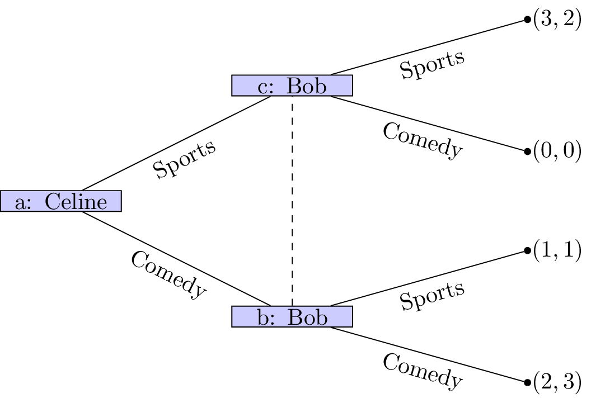

# OR 3: Lecture 2 - Normal Form Games

## Recap

In the [previous lecture](Lecture_1-Introduction.html) we discussed:

- Interactive decision making;
- Normal form games;
- Normal form games and representing information sets.

We did this looking at a game called "the battle of the sexes":

Can we think of a better way of representing this game?

## Normal form games

One other representation for a game is called the **normal form**.

### Definition

---

A $n$ player **normal form game** consists of:

1. A finite set of $n$ players;
2. Strategy spaces for the players: $S_1, S_2, S_3, \dots S_n$;
3. Payoff functions for the players: $u_i:S_{1}\times S_2\dots\times S_n\to \mathbb{R}$

---

A natrual way of representing a two player normal form game is using a **bi-matrix**:

$$\begin{pmatrix}
(u_1(s_1,r_1),u_2(s_1,r_1))&(u_1(s_1,r_2),u_2(s_1,r_2))&\dots&(u_1(s_1,r_2),u_2(s_1,r_n))\\
(u_1(s_2,r_1),u_2(s_2,r_1))&(u_1(s_2,r_2),u_2(s_2,r_2))&\dots&(u_1(s_2,r_2),u_2(s_2,r_n))\\
\vdots&\dots&\dots&\vdots\\
(u_1(s_m,r_1),u_2(s_m,r_1))&(u_1(s_m,r_2),u_2(s_m,r_2))&\dots&(u_1(s_m,r_2),u_2(s_m,r_n))\\
\end{pmatrix}$$

