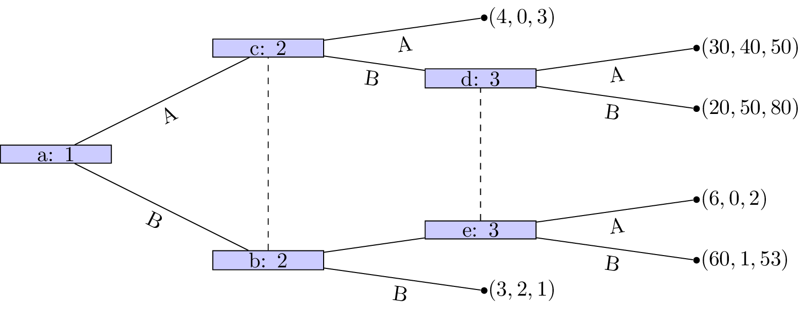
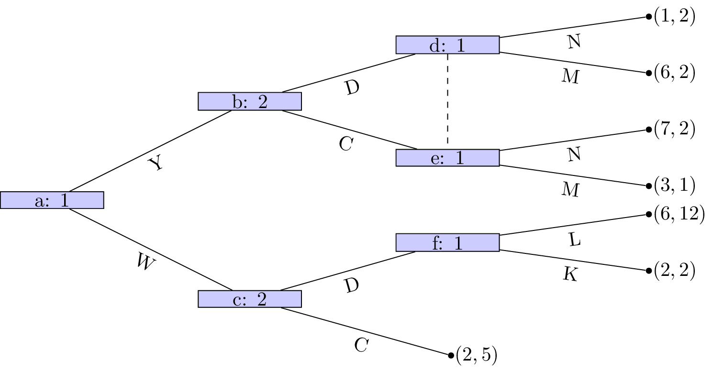
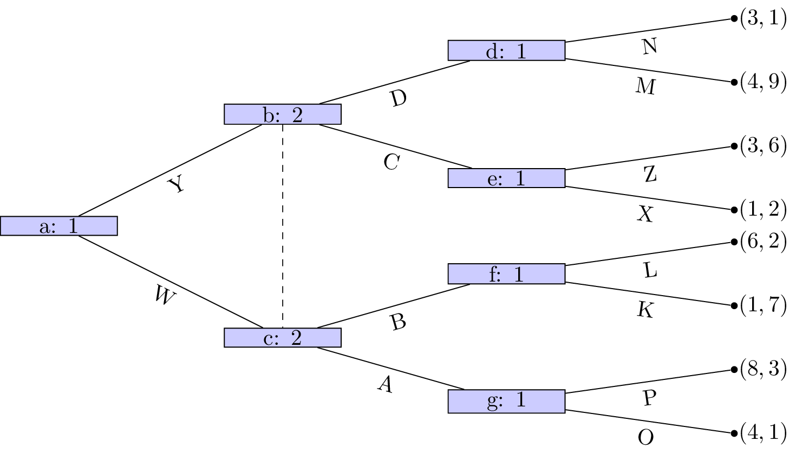
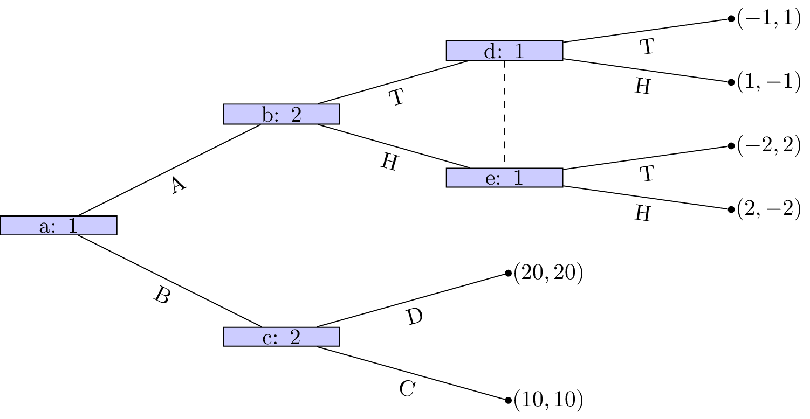

# Homework sheet 3 - Extensive form games, subgame perfect equilibrium and repeated games

1. Obtain the Nash equilibrium for the following games using backward induction:

    \
    \
    \
    \

2. Obtain the Nash equilibrium for the following game:

    _Player 1 chooses a number $x\geq 0$, which player 2 observes. After this simulataneously and independatly player 1 and player 2 choose $y_2, y_1\in\mathbb{R}$ respectively. The utility to player 1 is given by $2y_2y_1+xy_1-y_1^2-x^3/3$ and the utility to player 2 is given by $-(y_1-2y_2)^2$._

3. For each of the following games:

    i. Identify all subgames.
    ii. Identify the corresponding normal form representations and hence obtain all Nash equilibrium.
    iii. Identify which Nash equilibrium are also subgame perfect Nash equilibrium.

    \
    \
    \

4. For the following stage games:

    i. Plot all possible utility pairs for $T=2$;
    ii. Recalling that subgame perfect equilibrium for the repeated game must play a stage Nash equilibrium in the final stage attempt to identify a subgame perfect Nash equilibrium for the repeated game that is not a sequence of stage Nash profiles.

    $$\begin{pmatrix}
    (4,3)&(7,6)\\
    (1,1)&(4,3)
    \end{pmatrix}$$

    $$\begin{pmatrix}
    (5,8)&(0,3)\\
    (0,3)&(1,4)\\
    (1,6)&(0,3)\\
    \end{pmatrix}$$

    $$\begin{pmatrix}
    (1,2)&(0,3)&(-1,1)\\
    (-1,0)&(-1,-1)&(0,1)
    \end{pmatrix}$$

5. Consider the following stage game:

    $$\begin{pmatrix}
    (-1,1)&(3,-7)\\
    (-2,6)&(2,2)
    \end{pmatrix}$$

    i. For $\delta=1/3$ obtain the utilities for the infinitely repeated game for the strategies $S_D$: "play the first strategy throughout" and $S_C$: "play the second strategy throughout".
    ii. Plot the space of feasible average payoffs and the space of individually rational payoffs.
    iii. Obtain $\delta$ that ensures that a strategy profile exists that would give a subgame perfect Nash equilibrium with average payoffs: $(3/2,3/2)$, $(0,3)$, $(2,6)$ and $(2,0)$.
