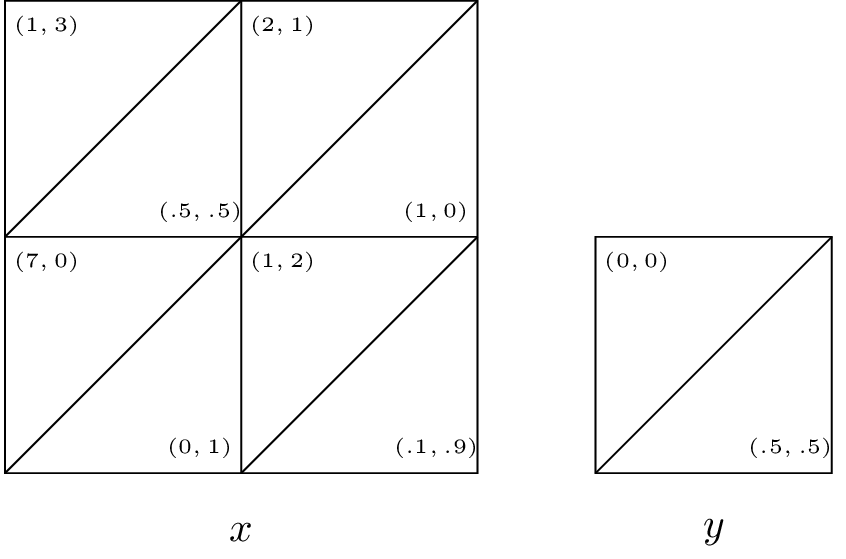

# Homework sheet 4 - Evolutionary games, games with incomplete information and stochastic games

1. Consider the pairwise contest games with the following associated two player games:

    $$\begin{pmatrix}
    (2,3)&(4,5)\\
    (4,5)&(1,2)\\
    \end{pmatrix}$$

    $$\begin{pmatrix}
    (1,-1)&(-1,1)\\
    (-1,1)&(1,-1)
    \end{pmatrix}$$

    $$\begin{pmatrix}
    (\alpha,3)&(1,\beta)\\
    (1,\beta)&(0,0)\\
    \end{pmatrix}$$

    Identify all evolutionary stable strategies.

2. Consider the following game:

    > In a mathematics department, researchers can choose to use one of two systems for typesetting their research papers: LaTeX or Word. We will refer to these two strategies as $L$ and $W$ respectively. A user of $W$ receives a basic utility of 1 and as $L$ is more widely used by mathematicians out of the department and is in general considered to be a better system a user of $L$ gets a basic utility of $\alpha$. Members of the mathematics department often collaborate and as such it is beneficial for the researchers to use the same typesetting system. If we let $\mu$ represent the proportion of users of $L$ we let:

    $$u(L,\chi)=2+2(1-x)$$
    $$u(W,\chi)=1+2(1-x)$$

    What are the evolutionary stable strategies?

3. Consider the simple game with two players: an insurer and a driver. The insurer sets a premium price $K\geq 0$, once that is done the driver can choose to buy insurance or not. It is assumed that the driver will have an accident with probability $p$, if the driver has an accident the financial cost is $A$. Represent this game in normal form and obtain the Nash equilibrium for the game as a function of the parameters. Modify your analysis assuming that the utility function to the driver is given by $u(x)=x^{1/\alpha}$ and the utility to the insurer is given by $u(x)=x^{1/\beta}$.

4. Repeat the analysis of the principal agent game assuming that $p$ is the probability of the project being successful in case of a high level of effort by the employee.

    i. What are the expected utilities to the employer and the employee?
    ii. Obtain a condition for which the employer should offer a bonus.

5. Obtain the Markov Nash equilibrium for the following games assuming $\delta=1/4$.

    \
    \
    \

6. Construct a two state stochastic game corresponding to an infinitely repeated game with the following stage game:

    $$\begin{pmatrix}
    (2,2)&(0,3)\\
    (3,0)&(1,1)
    \end{pmatrix}$$

    Show that the strategy $s_g$ ("player the first strategy until either player plays the second strategy") can be represented as a Markov strategy. For what values of $\delta$ is both players playing this strategy a Markov Nash equilibrium?
