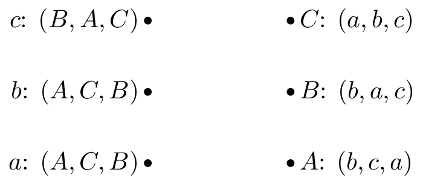
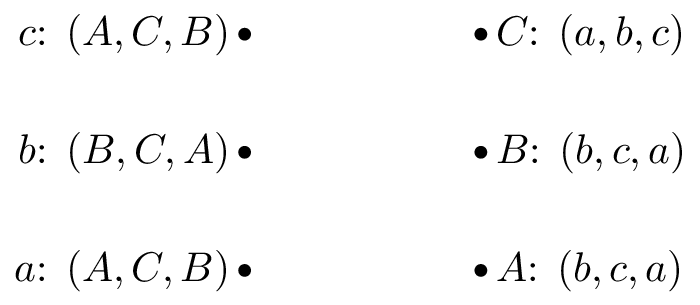
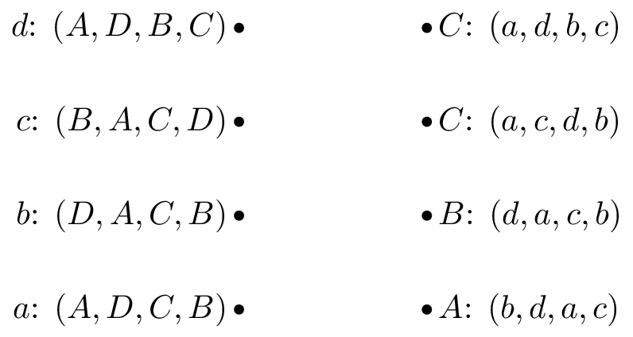
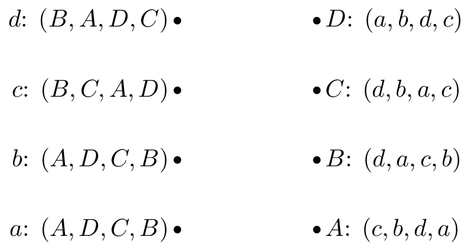
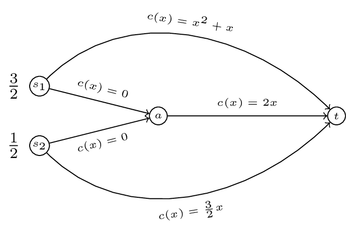
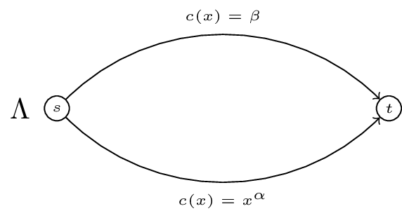

# Homework sheet 5 - Matching games, cooperative games and routing games

1. Obtain stable suitor optimal and reviewer optimal matchings for the following matching games:

2. Grab exercise from book.
3. For the following cooperative games:

i. Verify if the game is monotonic.
ii. Verify if the game is super additive.
iii. Obtain the Shapley value.

$$
v_1(C)=\begin{cases}
5,&\text{if }C=\{1\}\\
3,&\text{if }C=\{2\}\\
2,&\text{if }C=\{3\}\\
12,&\text{if }C=\{1,2\}\\
5,&\text{if }C=\{1,3\}\\
4,&\text{if }C=\{2,3\}\\
13,&\text{if }C=\{1,2,3\}\\
\end{cases}
$$

$$
v_2(C)=\begin{cases}
6,&\text{if }C=\{1\}\\
0,&\text{if }C=\{2\}\\
5,&\text{if }C=\{1,2\}\\
\end{cases}
$$

$$
v_4(C)=\begin{cases}
6,&\text{if }C=\{1\}\\
6,&\text{if }C=\{2\}\\
13,&\text{if }C=\{3\}\\
6,&\text{if }C=\{1,2\}\\
13,&\text{if }C=\{1,3\}\\
13,&\text{if }C=\{2,3\}\\
26,&\text{if }C=\{1,2,3\}\\
\end{cases}
$$

$$
v_4(C)=\begin{cases}
6,&\text{if }C=\{1\}\\
7,&\text{if }C=\{2\}\\
0,&\text{if }C=\{3\}\\
8,&\text{if }C=\{4\}\\
7,&\text{if }C=\{1,2\}\\
6,&\text{if }C=\{1,3\}\\
12,&\text{if }C=\{1,4\}\\
7,&\text{if }C=\{2,3\}\\
12,&\text{if }C=\{2,4\}\\
8&\text{if }C=\{3,4\}\\
7,&\text{if }C=\{1,2,3\}\\
24,&\text{if }C=\{1,2,4\}\\
12,&\text{if }C=\{1,3,4\}\\
12,&\text{if }C=\{2,3,4\}\\
25,&\text{if }C=\{1,2,3,4\}\\
\end{cases}
$$

4. Prove that the Shapley value has the following properties:

- Efficiency
- Null player
- Symmetry
- Additivity

Note that this does not prove that the Shapley value is the only vector that has those properties (it in fact is though).

5. Calculate the Nash flow and the optimal flow for the following routing games.

6. For a routing game the 'Price of Anarchy' is defined as:

$$\text{PoA}=\frac{C(\tilde f)}{C(f^*)}$$

For the following game (a generalisation of "Pigou's example") obtain the PoA as a function of $\alpha$.

Now obtain the PoA for the following game as a function of $\Lambda, \alpha$ and $\beta$. For what value of $\Lambda$ is the PoA at it's maximum?

