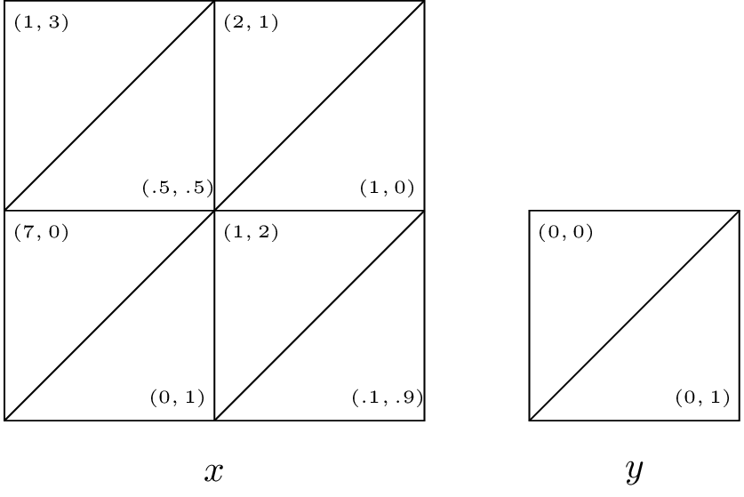
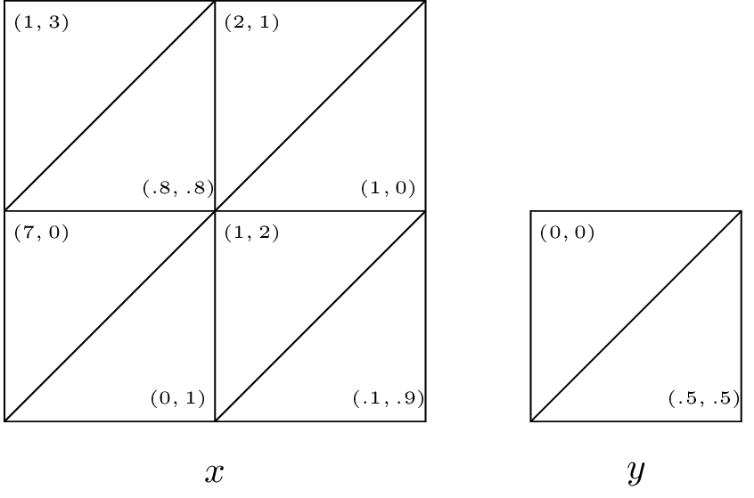

# Homework sheet 4 - Evolutionary games, games with incomplete information and stochastic games

1. Consider the pairwise contest games with the following associated two player games:

$$\begin{pmatrix}
(2,3)&(4,5)\\
(4,5)&(1,2)\\
\end{pmatrix}$$

$$\begin{pmatrix}
(1,-1)&(-1,1)\\
(-1,1)&(1,-1)
\end{pmatrix}$$

$$\begin{pmatrix}
(\alpha,3)&(1,\beta)\\
(1,\beta)&(0,0)\\
\end{pmatrix}$$

Identify all evolutionary stable strategies.

2. Consider the following game:

    > In a mathematics department, researchers can choose to use one of two systems for typesetting their research papers: LaTeX or Word. We will refer to these two strategies as $L$ and $W$ respectively. A user of $W$ receives a basic utility of 1 and as $L$ is more widely used by mathematicians out of the department and is in general considered to be a better system a user of $L$ gets a basic utility of $\alpha > 1$. Members of the mathematics department often collaborate and as such it is beneficial for the researchers to use the same typesetting system. If we let $\mu$ represent the proportion of users of $L$ we let:

    $$u(L,\chi)=\alpha+2\mu$$
    $$u(W,\chi)=1+2(1-\mu)$$

    What are the evolutionary stable strategies?

    **Solutions**

    Using the theorem for necessity of stability we have the following candidate ESS:

    1. $\sigma_L$: everyone uses $L$, thus $\mu=1$ (we have $u(L,\chi)>u(W,\chi)$.
    2. $\sigma_W$: everyone uses $W$, thus $\mu=0$ (we have $u(L,\chi)<u(W,\chi)$.
    3. $\sigma_m$: some use $L$ and some use $W$, by the theorem we have $u(L,\chi)=u(W,\chi)$ which implies $\alpha+2\mu=1+2(1-\mu)$ giving $\mu=\frac{3-\alpha}{4}$.

    Now we consider the post entry population $\chi_\epsilon=(1-\epsilon)\sigma^*+\epsilon\sigma$ (where $\sigma^*$ is the base strategy and $\sigma$ is the entry population). We denote $\sigma=(\mu,1-\mu)$ and $\sigma^*=(\mu^*,1-\mu^*)$ and $\delta = u(\sigma^*,\chi_\epsilon)-u(\sigma,\chi_\epsilon)$. We have:

    $$
    \delta = \mu^*u(L,\chi_\epsilon)+(1-\mu^*)u(W,\chi_\epsilon))-\mu u(L,\chi_\epsilon)+(1-\mu)u(W,\chi_\epsilon))=(\mu^*-\mu)(u(L,\chi_\epsilon)-u(W,\chi_\epsilon))
    $$

    which gives:

    $$
    \delta = (\mu^*-\mu)(\alpha-3+4((1-\epsilon)\mu^*+\epsilon\mu))=(\mu^*-\mu)(4\mu^*+\alpha-3+4\epsilon(\mu-\mu^*))
    $$

    We now consider each potential ESS in turn, if $\delta>0$ for all $\epsilon<\bar\epsilon$ for some $\bar\epsilon$ then we have an ESS (this is by definition):

    1. $\mu^*=1$: $\delta=(1-\mu)(1+\alpha+4\epsilon(\mu-1))>(1-\mu)(1+\alpha-4\epsilon)>0$ for all $\mu\ne1$ and $\epsilon<\bar\epsilon=\frac{1+\alpha}{4}$. Thus $\sigma_L$ is an ESS.
    2. $\mu^*=0$: $\delta=-\mu(\alpha - 3+4\epsilon\mu)$. If $\alpha\geq 3$ then $\delta \leq 0$ for all values of $\mu, \epsilon$, thus if $L$ is 3 times better than $W$ $\sigma_W$ is not an ESS. If $\alpha<3$ $\delta>0$ $\Leftrightarrow$ $\alpha-3+4\epsilon\mu<0$ $\Rightarrow$ $\alpha-3+4\epsilon\mu<\alpha-3+4\epsilon<0$ for all $\mu\ne 0$ $\epsilon<\bar\epsilon=\frac{3-\alpha}{4}$. Thus $\sigma_W$ is an ESS for $\alpha<3$.
    3. $\mu^*=\frac{3-\alpha}{4}$: $\delta=-4\epsilon\left(\frac{3-\alpha}{4}-\mu\right)^2<0$ for all $\mu\ne\frac{3-\alpga}{4}$ and for all $\epsilon>0$ so $\sigma_m$ is not an ESS.

3. Consider the simple game with two players: an insurer and a driver. The insurer sets a premium price $K\geq 0$, once that is done the driver can choose to buy insurance or not. It is assumed that the driver will have an accident with probability $p$, if the driver has an accident the financial cost is $A$. Represent this game in normal form and obtain the Nash equilibrium for the game as a function of the parameters. Modify your analysis assuming that the utility function to the driver is given by $u(x)=x^{1/\alpha}$ and the utility to the insurer is given by $u(x)=x^{1/\beta}$.

4. Repeat the analysis of the principal agent game assuming that $p$ is the probability of the project being successful in case of a high level of effort by the employee.

i. What are the expected utilities to the employer and the employee?
ii. Obtain a condition for which the employer should offer a bonus.

5. Obtain the Markov Nash equilibrium for the following games assuming $\delta=1/4$.

\
\
\

6. Construct a two state stochastic game corresponding to an infinitely repeated game with the following stage game:

$$\begin{pmatrix}
(2,2)&(0,3)\\
(3,0)&(1,1)
\end{pmatrix}$$

Show that the strategy $s_g$ ("player the first strategy until either player plays the second strategy") can be represented as a Markov strategy. For what values of $\delta$ is both players playing this strategy a Markov Nash equilibrium?
